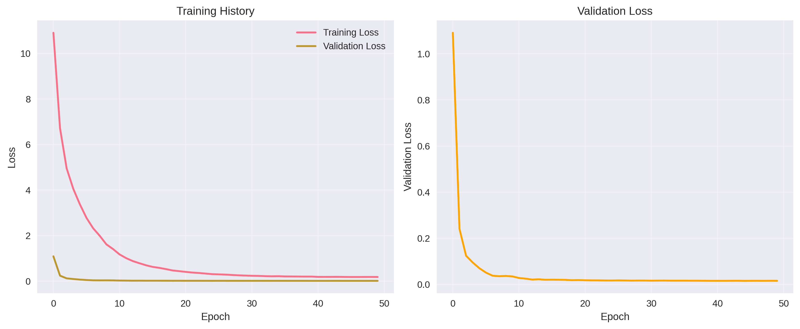
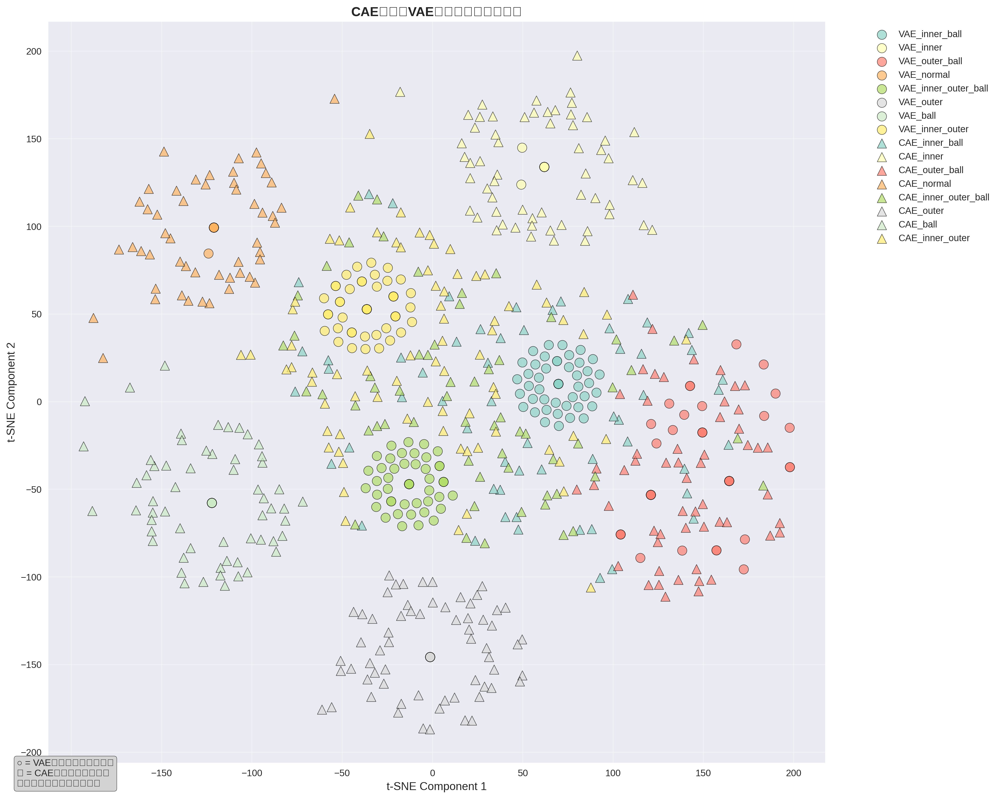
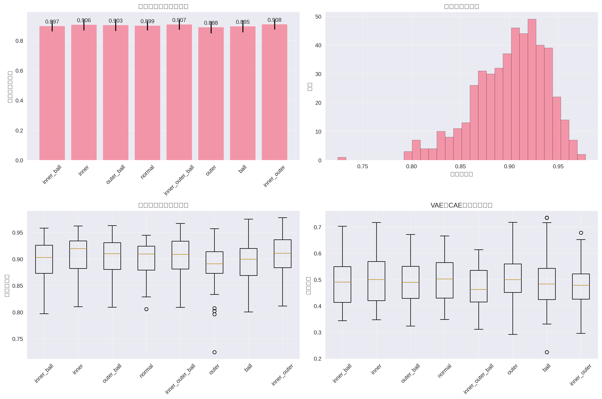

# CAE特征到VAE语义空间的投影网络实现

本项目实现了一个语义投影网络，用于将CAE(Contrastive Autoencoder)提取的512维图像特征投影到VAE(Variational Autoencoder)的语义空间中。

## 项目概述

### 核心功能
- **语义投影网络**：实现CAE特征到VAE语义空间的映射
- **训练模块**：在单一故障数据上训练投影网络
- **特征对齐**：使投影后的CAE特征与VAE语义特征对齐
- **可视化模块**：在同一语义空间中展示VAE直接提取的语义特征和CAE投影后的特征

### 技术架构
- **输入**：CAE特征 (512维)
- **输出**：VAE语义特征 (16维，基于实际数据调整)
- **网络结构**：512 → 256 → 128 → 16 的全连接网络
- **损失函数**：MSE损失用于特征对齐

## 文件结构

```
├── semantic_projection.py          # 主要实现文件
├── demo_semantic_projection.py     # 演示脚本
├── semantic_features_16d.npz       # VAE语义特征数据
├── models/                         # 模型保存目录
│   ├── best_model.pth
│   └── final_model.pth
├── demo_results/                   # 演示结果目录
│   ├── training_history.png
│   ├── semantic_space_comparison.png
│   ├── feature_alignment_analysis.png
│   └── demo_results_summary.json
└── figures/                        # 可视化结果目录
```

## 快速开始

### 1. 环境要求

```bash
pip install torch numpy scipy matplotlib scikit-learn seaborn pandas tqdm
```

### 2. 运行演示程序

```bash
python demo_semantic_projection.py
```

这将执行完整的演示流程，包括：
- 数据生成和预处理
- 模型训练
- 性能评估
- 可视化结果生成

### 3. 直接使用API

```python
import semantic_projection as sp

# 1. 创建语义投影网络
model = sp.SemanticProjection(cae_dim=512, vae_dim=16)

# 2. 生成数据
data_generator = sp.DataGenerator()
train_dataset, val_dataset, train_labels, val_labels = data_generator.generate_dataset()

# 3. 训练模型
trainer = sp.SemanticProjectionTrainer(model)
history = trainer.train(train_loader, val_loader)

# 4. 使用模型进行投影
cae_features = torch.randn(32, 512)  # 示例CAE特征
projected_features = model(cae_features)  # 投影到VAE语义空间
```

## 核心组件

### 1. SemanticProjection 网络

```python
class SemanticProjection(nn.Module):
    def __init__(self, cae_dim=512, vae_dim=16, dropout_rate=0.3):
        super().__init__()
        self.projection = nn.Sequential(
            nn.Linear(cae_dim, 256),
            nn.ReLU(),
            nn.Dropout(dropout_rate),
            nn.BatchNorm1d(256),
            nn.Linear(256, 128),
            nn.ReLU(),
            nn.Dropout(dropout_rate),
            nn.BatchNorm1d(128),
            nn.Linear(128, vae_dim),
        )
```

### 2. 训练器 (SemanticProjectionTrainer)

- 支持早停机制
- 自动模型保存
- 学习率调度
- 梯度裁剪

### 3. 数据生成器 (DataGenerator)

- 加载现有VAE语义特征
- 生成对应的CAE特征
- 支持数据增强
- 自动划分训练/验证集

### 4. 可视化器 (SemanticVisualizer)

- 训练历史可视化
- t-SNE语义空间可视化
- 特征对齐分析
- 多种性能指标图表

## 可视化结果

### 1. 训练历史


### 2. 语义空间对比


### 3. 特征对齐分析


## 性能指标

基于演示数据的性能指标：

- **最佳验证损失**: 0.015425
- **平均特征对齐度**: 0.900479 (余弦相似度)
- **训练时间**: 4.67秒 (50个epoch)

### 各故障类型对齐度分析

| 故障类型 | 平均相似度 | 标准差 |
|---------|-----------|--------|
| inner_outer_ball | 0.9071 | 0.0346 |
| inner_outer | 0.9084 | 0.0342 |
| inner | 0.9057 | 0.0375 |
| outer | 0.8884 | 0.0399 |
| ball | 0.8951 | 0.0400 |
| normal | 0.8992 | 0.0315 |
| inner_ball | 0.8971 | 0.0357 |
| outer_ball | 0.9028 | 0.0388 |

## 配置参数

```python
CONFIG = {
    'cae_feature_dim': 512,        # CAE特征维度
    'vae_semantic_dim': 16,        # VAE语义空间维度
    'batch_size': 64,              # 批处理大小
    'learning_rate': 1e-3,         # 学习率
    'epochs': 200,                 # 训练轮数
    'dropout_rate': 0.3,           # Dropout比例
    'early_stopping_patience': 20, # 早停耐心值
    'weight_decay': 1e-5,          # 权重衰减
    'tsne_perplexity': 30,         # t-SNE困惑度
    'tsne_n_iter': 1000,           # t-SNE迭代次数
}
```

## 使用场景

### 1. 故障诊断
- 轴承故障检测
- 复合故障识别
- 零样本学习

### 2. 特征融合
- 多模态特征对齐
- 跨域特征映射
- 语义空间统一

### 3. 模型集成
- CAE和VAE模型结合
- 特征空间对齐
- 知识蒸馏

## 扩展功能

### 1. 自定义数据加载

```python
# 加载自己的VAE语义特征
def load_custom_vae_features(file_path):
    data = np.load(file_path)
    return data['semantic_features']

# 加载自己的CAE特征
def load_custom_cae_features(file_path):
    data = np.load(file_path)
    return data['cae_features']
```

### 2. 模型改进

```python
# 添加注意力机制
class AttentionProjection(SemanticProjection):
    def __init__(self, *args, **kwargs):
        super().__init__(*args, **kwargs)
        self.attention = nn.MultiheadAttention(embed_dim=256, num_heads=8)
    
    def forward(self, x):
        # 添加注意力机制的前向传播
        pass
```

### 3. 损失函数扩展

```python
# 添加对比损失
class ContrastiveLoss(nn.Module):
    def __init__(self, margin=1.0):
        super().__init__()
        self.margin = margin
    
    def forward(self, anchor, positive, negative):
        # 实现对比损失
        pass
```

## 故障排除

### 1. 常见问题

**Q: 训练损失不下降**
- 检查学习率设置
- 增加训练数据量
- 调整网络结构

**Q: 内存不足**
- 减少batch_size
- 使用梯度累积
- 启用混合精度训练

**Q: 特征对齐度低**
- 增加训练轮数
- 调整损失函数权重
- 检查数据质量

### 2. 性能优化

```python
# 使用混合精度训练
from torch.cuda.amp import autocast, GradScaler

scaler = GradScaler()
with autocast():
    output = model(input)
    loss = criterion(output, target)

scaler.scale(loss).backward()
scaler.step(optimizer)
scaler.update()
```

## 贡献指南

1. Fork 本项目
2. 创建特性分支 (`git checkout -b feature/AmazingFeature`)
3. 提交更改 (`git commit -m 'Add some AmazingFeature'`)
4. 推送到分支 (`git push origin feature/AmazingFeature`)
5. 创建 Pull Request

## 许可证

本项目采用 MIT 许可证 - 详见 [LICENSE](LICENSE) 文件

## 联系方式

如有问题或建议，请通过以下方式联系：

- 创建 GitHub Issue
- 发送邮件至项目维护者

## 更新日志

### v1.0.0 (2025-01-12)
- 初始版本发布
- 实现基本的语义投影网络
- 支持训练、评估和可视化
- 提供完整的演示程序

## 致谢

感谢所有为本项目做出贡献的开发者和研究人员。

特别感谢：
- PyTorch 团队提供的深度学习框架
- scikit-learn 团队提供的机器学习工具
- matplotlib 和 seaborn 团队提供的可视化工具